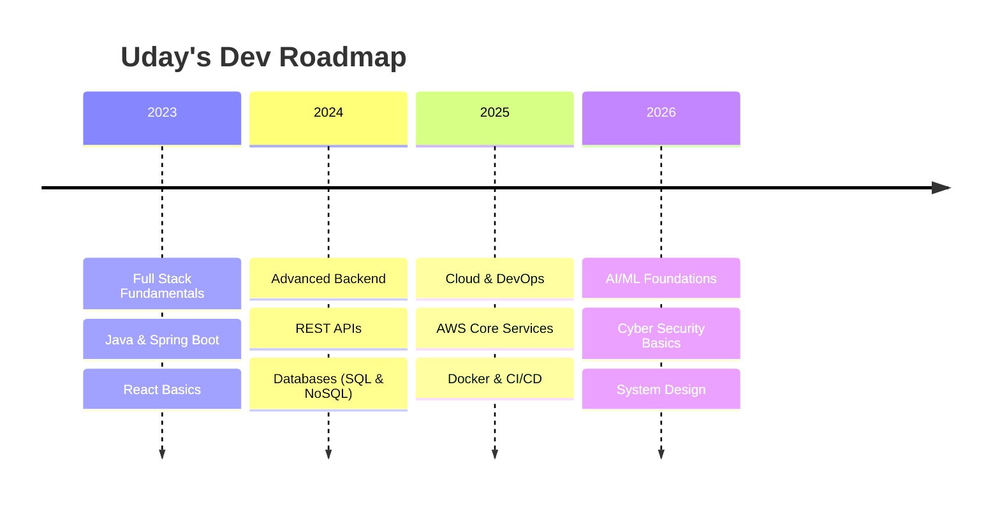

<div align="center">


<a href="https://udaysharma.me">
  
</a>
<a href="https://www.linkedin.com/in/udysharma">
  
</a>
<a href="mailto:udaysharma6x@gmail.com">
  
</a>

</div>

<br>

```yaml
whoami:
  name: "Uday Sharma"
  role: ["Software Engineer", "Full Stack Developer", "Cloud & DevOps Enthusiast"]
  status: "Building things that (hopefully) don't break in production 🚀"
  currently_exploring: ["Distributed Systems", "AI/ML", "Cyber Security"]
  fun_fact: "My code compiles on the first try... in my dreams."
```

<div align="center">


</div>

---

## 🧭 Quick Navigation

<div align="center">

[](#-about-me)
[](#-tech-arsenal)
[](#-featured-work)
[](#-github-analytics)
[](#-learning-journey)
[](#-lets-build-something)

</div>

---

## 📖 About Me


- 🎓 B.Tech Computer Science Student
- 💻 Building full-stack apps that scale — Java • Spring Boot • React
- ☁ Deploying and automating on **AWS**
- ⚙ Living the **DevOps** life — CI/CD, containers, and automation
- 🤖 Exploring **Machine Learning** one model at a time
- 🔐 Sharpening my edge in **Cyber Security**
- 🌱 Philosophy: *ship, learn, refactor, repeat*
- 💬 Ask me about: system design, cloud architecture, or my last debugging war story

<br clear="right"/>

---

## ⚡ Tech Arsenal

<div align="center">

**Languages & Frameworks**
<br>


**Databases & Cloud**
<br>


**Tools & Platforms**
<br>


</div>

<details>
<summary>🎯 <b>Proficiency Breakdown</b> — click to expand</summary>
<br>

| Domain | Stack | Confidence |
|---|---|---|
| Backend | Java, Spring Boot, Node.js, Express | ⭐⭐⭐⭐⭐ |
| Frontend | React, Next.js, Tailwind CSS | ⭐⭐⭐⭐☆ |
| Cloud/DevOps | AWS, Docker, CI/CD | ⭐⭐⭐☆☆ |
| AI/ML | Python, scikit-learn, basics of DL | ⭐⭐⭐☆☆ |
| Security | Network & App Security fundamentals | ⭐⭐☆☆☆ |

</details>

---

## 🛠 Featured Work

<div align="center">

<a href="https://udaysharma.me">

</a>

</div>

> 💡 *Pinning your best repos here makes this section shine — GitHub lets you pin up to 6 directly below your profile bio.*

---

## 📊 GitHub Analytics

<p align="center">
  
  
</p>

<p align="center">
  
</p>

<p align="center">
  
</p>

---

## 🐍 Contribution Snake

<p align="center">
  
</p>

<sub>⚙ Powered by the <a href="https://github.com/Platane/snk">snk</a> GitHub Action — animates your contribution graph into a snake game. Requires a one-time workflow setup in your repo.</sub>

---

## 🗺 Learning Journey



```text
☕ Spring Boot        ████████████████████░  95%
☁ AWS                ███████████████████░░  90%
🐳 Docker             █████████████████░░░░  85%
⚙ DevOps             ███████████████████░░  90%
🤖 Machine Learning   ███████████████░░░░░░  75%
🔐 Cyber Security     █████████████░░░░░░░░  65%
```

---

## 🏆 Trophy Case

<p align="center">
  
</p>

---

## 💭 Dev Wisdom of the Day

<p align="center">
  
</p>

---

## 📬 Let's Build Something

<div align="center">


<br><br>

**Have an idea, a bug to squash, or just want to talk tech?**

<a href="https://udaysharma.me">

</a>
<a href="https://www.linkedin.com/in/udysharma">

</a>
<a href="mailto:udaysharma6x@gmail.com">

</a>

<br><br>


</div>


<div align="center">
<sub>⭐ If this profile sparked an idea for your own — feel free to fork the format!</sub>
</div>
